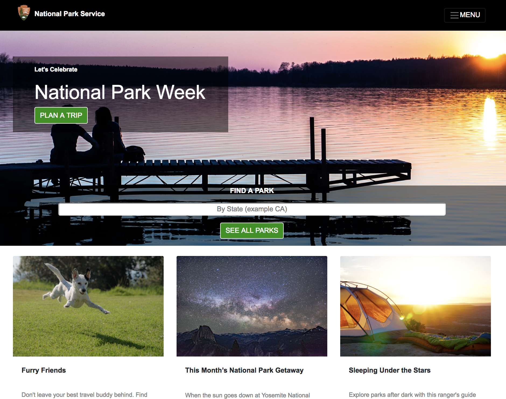
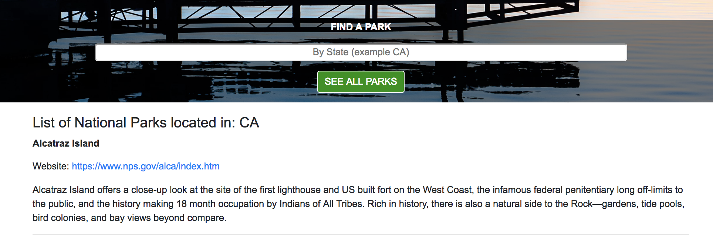
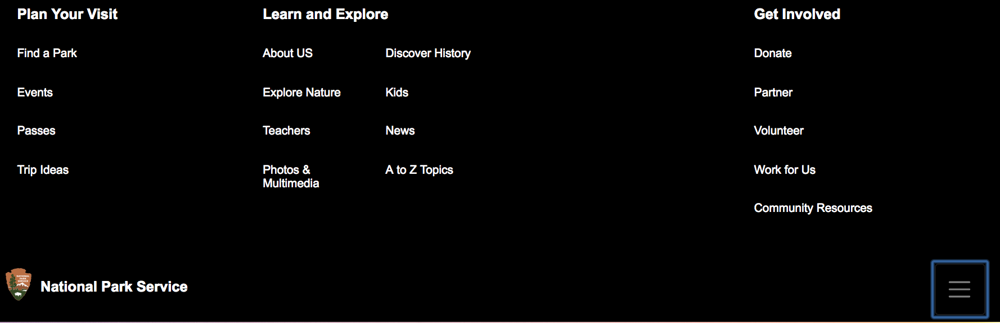

# Recreate National Park Service website using Angular5
#### Epicodus Week 3 and 4 Independent Project 03/30/18 and 04/06/18

## By Hannah Lee

#### Deployed here: https://national-park-service-clone.firebaseapp.com
#### NPS.gov https://www.nps.gov

  

## Features

1. As a user, enter a state and return a list of National Parks by state and a description for each.

  

2. As a user, see a navigation bar with a hamburger icon that toggles and lists items to search on the site, for example: Plan Your Visit, Learn and Explore, and Get Involved.

  

3. As a user, see a hero image on the homepage displaying current theme for the organization.

  

4. As a user, see blog entries and click on each for additional information.

  

5. As a user, see a footer with informational and social media links.

  

## Technologies Used

```
Application: Angular CLI, TypeScript, Bootstrap, HTML
Environment: ng, npm, webpack, tslint
Database: Firebase
API: National Park Service
```

## Installation

```
$ git clone https://github.com/RunHannah/nps
```

_Requires node.js; instructions to install:_ https://www.learnhowtoprogram.com/javascript/getting-started-with-javascript-2f9a73dc-b7f5-4a22-9101-e69d49f552ac/installing-node-js

Install required npm packages and dependencies:

```
$ npm install
```

_Requires AngularFire; instructions to install and add credentials:_
https://www.learnhowtoprogram.com/javascript/angular-extended/firebase-introduction-and-setup

_Create a database in Firebase by importing the file blog-posts.json._
Instructions to create a free account:
  https://www.learnhowtoprogram.com/javascript/angular-extended/firebase-introduction-and-setup

Once Firebase database is setup, create the file: api-keys.ts under src/app path and copy and paste Firebase credentials using the following syntax :

```
export var masterFirebaseConfig = {
    apiKey: "xxxx",
    authDomain: "xxxx.firebaseapp.com",
    databaseURL: "https://xxxx.firebaseio.com",
    storageBucket: "xxxx.appspot.com",
    messagingSenderId: "xxxx"
  };
```

Obtain a National Park Service API key from: https://www.nps.gov/subjects/developer/get-started.htm <br>
Under /src/app create a file: api-keys.ts <br>
Copy and paste the following with apiKey between the quotes in the api-keys.ts file:

```
export const npsApiKey = "apiKey goes here"
```

Locate the .gitignore file and include the following path to be ignored:

```
/src/app/api-keys.ts
```

In the command line run:

```
$ ng serve --open
```

Navigate to http://localhost:4200/ from your browser.
